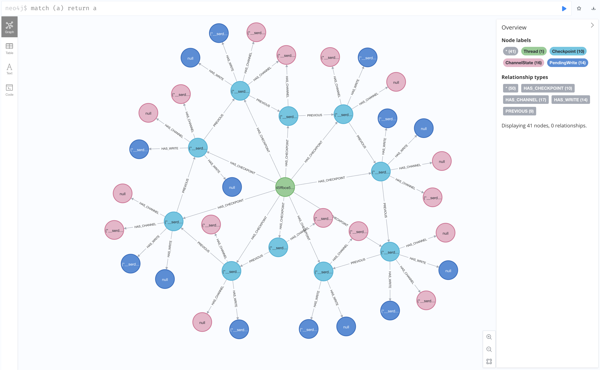
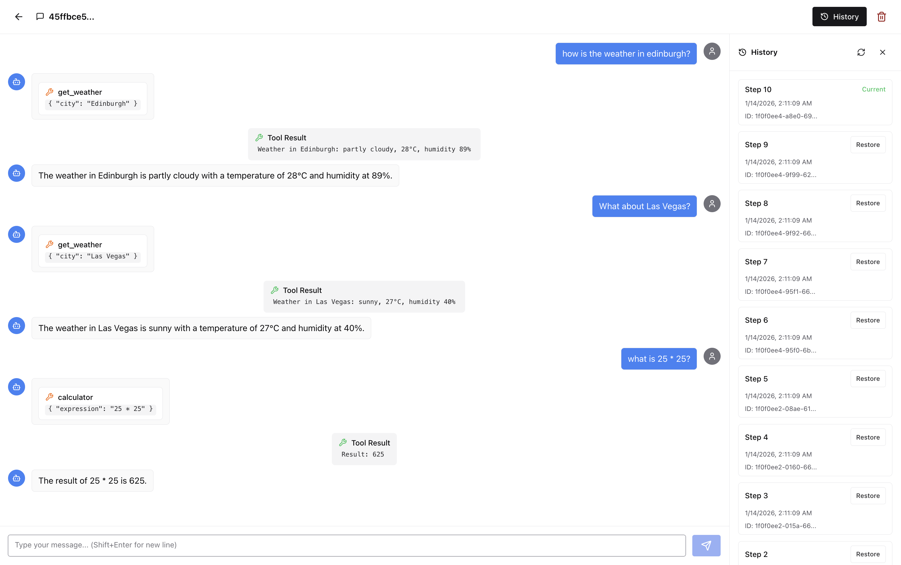

# LangGraph Neo4j Checkpointer Demo

Demo application showcasing the Neo4j checkpoint saver from [langchain-neo4j](https://github.com/langchain-ai/langchain-neo4j) (v0.8.0+) for persistent LangGraph agent memory with branching time-travel support.

## Features

- **Persistent Agent Memory**: Store and retrieve LangGraph checkpoints in Neo4j using `langchain-neo4j>=0.8.0`
- **Graph-Native Data Model**: Leverages Neo4j relationships for efficient traversal
- **Branching Time-Travel**: Fork conversations from any checkpoint without losing history
- **Full-Stack Demo**: FastAPI backend + Next.js frontend showcasing all features

## Quick Start

### Using langchain-neo4j Checkpointer

Install the package:

```bash
pip install langchain-neo4j>=0.8.0
```

### Synchronous Usage

```python
from neo4j import GraphDatabase
from langchain_neo4j import Neo4jSaver
from langgraph.graph import StateGraph

# Create Neo4j driver
driver = GraphDatabase.driver("bolt://localhost:7687", auth=("neo4j", "password"))

# Create and setup checkpointer
checkpointer = Neo4jSaver(driver)
checkpointer.setup()  # Creates indexes and constraints

# Build your LangGraph agent
graph = StateGraph(...)
compiled = graph.compile(checkpointer=checkpointer)

# Run with thread_id for persistence
config = {"configurable": {"thread_id": "my-conversation"}}
result = compiled.invoke({"messages": [("user", "Hello!")]}, config)

# Continue the conversation (state is automatically restored)
result = compiled.invoke({"messages": [("user", "What did I just say?")]}, config)
```

### Asynchronous Usage

```python
from neo4j import AsyncGraphDatabase
from langchain_neo4j import AsyncNeo4jSaver

# Create async driver
driver = AsyncGraphDatabase.driver("bolt://localhost:7687", auth=("neo4j", "password"))

# Create async checkpointer
checkpointer = AsyncNeo4jSaver(driver)
await checkpointer.setup()

# Use with async LangGraph
compiled = graph.compile(checkpointer=checkpointer)
result = await compiled.ainvoke({"messages": [...]}, config)

# Don't forget to close
await checkpointer.close()
```

### Context Manager

```python
from langchain_neo4j import Neo4jSaver

with Neo4jSaver.from_conn_string(
    uri="bolt://localhost:7687",
    user="neo4j",
    password="password"
) as checkpointer:
    checkpointer.setup()
    graph = builder.compile(checkpointer=checkpointer)
    result = graph.invoke({"messages": [...]}, config)
```

## Neo4j Graph Data Model

The checkpointer uses a graph model with nodes and relationships:

```
                         ┌─────────────────────────────────────┐
                         │                                     │
                         ▼                                     │
(:Thread)──[HAS_CHECKPOINT]──►(:Checkpoint)──[PREVIOUS]────────┘
    │                              │
    │                    ┌─────────┼─────────┐
    │                    │         │         │
    ▼                    ▼         ▼         ▼
[HAS_BRANCH]       [HAS_CHANNEL] [HAS_WRITE] [ON_BRANCH]
    │                    │         │         │
    ▼                    ▼         ▼         │
(:Branch)◄────────(:ChannelState) (:PendingWrite)
    │                                        │
    └────────────[HEAD]──────────────────────┘
```

### Node Types

| Node | Description | Key Properties |
|------|-------------|----------------|
| `Thread` | Conversation thread | `thread_id`, `checkpoint_ns` |
| `Checkpoint` | Point-in-time state | `checkpoint_id`, `checkpoint`, `metadata`, `created_at` |
| `ChannelState` | Channel value storage | `channel`, `version`, `type`, `blob` |
| `PendingWrite` | Fault-tolerant writes | `task_id`, `channel`, `blob`, `idx` |
| `Branch` | Conversation branch | `branch_id`, `name`, `fork_point_id`, `created_at` |

### Relationships

| Relationship | Description |
|--------------|-------------|
| `HAS_CHECKPOINT` | Thread owns checkpoints |
| `PREVIOUS` | Checkpoint parent chain |
| `HAS_CHANNEL` | Checkpoint to channel states |
| `HAS_WRITE` | Checkpoint to pending writes |
| `HAS_BRANCH` | Thread owns branches |
| `ACTIVE_BRANCH` | Thread's current active branch |
| `HEAD` | Branch's latest checkpoint |
| `ON_BRANCH` | Checkpoint belongs to branch |



## Branching Time-Travel

The checkpointer supports non-destructive time-travel through branching. When you "restore" to a previous checkpoint, a new branch is created instead of deleting history.

### How It Works

1. **Main Branch**: Created automatically on first checkpoint
2. **Active Branch**: Each thread has one active branch
3. **HEAD**: Points to the latest checkpoint on the active branch
4. **Forking**: Creates a new branch from any historical checkpoint

### Using Branches

```python
from langchain_neo4j.checkpoint.base import (
    CYPHER_CREATE_BRANCH,
    CYPHER_SET_ACTIVE_BRANCH,
    CYPHER_LIST_BRANCHES,
)

# List branches for a thread
with driver.session() as session:
    result = session.run(
        CYPHER_LIST_BRANCHES,
        {"thread_id": "my-thread", "checkpoint_ns": ""}
    )
    for branch in result:
        print(f"Branch: {branch['name']}, Active: {branch['is_active']}")

# Create a new branch from a checkpoint
with driver.session() as session:
    session.run(
        CYPHER_CREATE_BRANCH,
        {
            "thread_id": "my-thread",
            "checkpoint_ns": "",
            "branch_id": "my-fork",
            "name": "experiment-1",
            "fork_point_id": "checkpoint-id-to-fork-from"
        }
    )

# Switch active branch
with driver.session() as session:
    session.run(
        CYPHER_SET_ACTIVE_BRANCH,
        {
            "thread_id": "my-thread",
            "checkpoint_ns": "",
            "branch_id": "my-fork"
        }
    )
```

## Demo Application

This repository includes a full-stack demo application showcasing all features of the langchain-neo4j checkpointer.



### Prerequisites

- Python 3.10+
- Node.js 18+
- [uv](https://docs.astral.sh/uv/) package manager
- Neo4j 5.0+ (local instance or [Neo4j Aura](https://neo4j.com/cloud/aura/))
- OpenAI API key

### Environment Setup

Create a `.env` file in the repository root (or copy from `.env.example`):

```env
# Neo4j connection settings
NEO4J_URI=bolt://localhost:7687
NEO4J_USER=neo4j
NEO4J_PASSWORD=your-neo4j-password

# OpenAI API key for the chat agent
OPENAI_API_KEY=your-openai-api-key
```

Create a `.env.local` file in `demo/frontend/`:

```env
NEXT_PUBLIC_API_URL=http://localhost:8000/api
```

### Running the Demo

**Install dependencies:**

```bash
make install
```

This installs both backend (Python) and frontend (Node.js) dependencies.

**Start the backend:**

```bash
make backend
```

The API will be available at http://localhost:8000

**Start the frontend:**

```bash
make frontend
```

The frontend will be available at http://localhost:3000

### Demo Features

- Create and manage conversation threads
- Chat with an AI agent (uses OpenAI gpt-4o-mini)
- View checkpoint history timeline
- Fork from any checkpoint (time-travel)
- Switch between branches
- Tools: Calculator and Weather lookup

### Backend API Endpoints

| Method | Endpoint | Description |
|--------|----------|-------------|
| GET | `/api/threads` | List all threads |
| POST | `/api/threads` | Create new thread |
| DELETE | `/api/threads/{id}` | Delete thread |
| GET | `/api/messages/{threadId}` | Get thread messages |
| POST | `/api/messages/{threadId}` | Send message |
| GET | `/api/history/{threadId}/checkpoints` | List checkpoints |
| GET | `/api/history/{threadId}/branches` | List branches |
| POST | `/api/history/{threadId}/fork` | Fork from checkpoint |
| POST | `/api/history/{threadId}/switch-branch` | Switch active branch |
| POST | `/api/history/{threadId}/time-travel` | Fork and switch (time-travel) |
| GET | `/api/history/{threadId}/tree` | Get checkpoint tree |

### Demo Architecture

```
.
├── .env                        # Neo4j and OpenAI credentials
├── .env.example                # Example environment file
├── Makefile                    # Build and run commands
└── demo/
    ├── backend/
    │   ├── pyproject.toml
    │   └── app/
    │       ├── main.py             # FastAPI app
    │       ├── config.py           # Settings from environment
    │       ├── routers/
    │       │   ├── threads.py
    │       │   ├── messages.py
    │       │   └── history.py      # Branch/time-travel endpoints
    │       └── agent/
    │           ├── graph.py        # LangGraph agent
    │           └── tools.py        # Calculator, Weather tools
    └── frontend/
        ├── package.json
        ├── .env.local              # API URL config
        ├── app/                    # Next.js pages
        ├── components/
        │   ├── ChatInterface.tsx
        │   ├── MessageList.tsx
        │   ├── MessageInput.tsx
        │   └── HistoryTimeline.tsx # Branch UI
        └── lib/
            ├── api.ts              # API client
            └── types.ts            # TypeScript types
```

## Cypher Query Reference

### Viewing the Graph in Neo4j Browser

```cypher
// View threads and their checkpoints
MATCH (t:Thread)-[r1:HAS_CHECKPOINT]->(c:Checkpoint)
OPTIONAL MATCH (c)-[r2:PREVIOUS]->(parent:Checkpoint)
OPTIONAL MATCH (c)-[r3:HAS_CHANNEL]->(cs:ChannelState)
RETURN t, c, parent, cs, r1, r2, r3 LIMIT 50

// View branches for a thread
MATCH (t:Thread {thread_id: "your-thread-id"})-[:HAS_BRANCH]->(b:Branch)
OPTIONAL MATCH (t)-[:ACTIVE_BRANCH]->(active:Branch)
OPTIONAL MATCH (b)-[:HEAD]->(head:Checkpoint)
RETURN b.name, b.branch_id, 
       active.branch_id = b.branch_id as is_active,
       head.checkpoint_id

// Trace checkpoint chain (history)
MATCH path = (c:Checkpoint)-[:PREVIOUS*]->(root:Checkpoint)
WHERE NOT (root)-[:PREVIOUS]->()
RETURN path

// Count entities
MATCH (t:Thread) RETURN 'Threads' as type, count(t) as count
UNION ALL
MATCH (c:Checkpoint) RETURN 'Checkpoints' as type, count(c) as count
UNION ALL
MATCH (b:Branch) RETURN 'Branches' as type, count(b) as count
```

## Requirements

- Python >= 3.10
- Neo4j >= 5.0
- langchain-neo4j >= 0.8.0

## License

MIT
